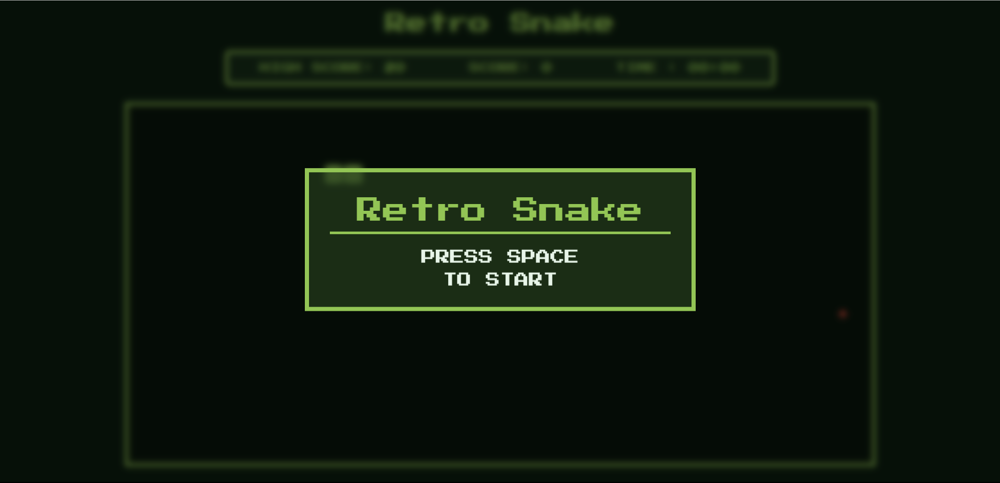

# 🐍 Retro Snake
A retro-style **Snake game** built using **HTML, CSS, and Vanilla JavaScript**, inspired by classic pixel arcade games.
The goal of this project was to deeply understand **grid-based game logic**, **game loops**, and **DOM-based rendering**, while keeping a clean retro pixel aesthetic.


## 🎮 Live Demo
👉 [Retro-Snake](https://joydeep-devx.github.io/retro-snake/)


## 📸 Preview



## ✨ Features
- Retro pixel-style UI 🎨
- Smooth snake movement using a game loop
- Responsive rectangular game board (works on large screens)
- Start & Game Over overlays
- Score tracking
- Animated food (blink / pulse effect)
- Keyboard controls
- Deployed using GitHub Pages

## 🕹️ Controls
- **Arrow Keys** → Move the snake
- **Space Bar** → Start / Restart the game

## 📂 Project Structure
```
retro-snake/
├── index.html
├── style.css
├── assets
├── favicon.png
└── README.md
```


## 🧠 JavaScript Game Flow


## 🛠️ Technologies Used
- **HTML5**
- **CSS3** (Grid, Animations, Pixel styling)
- **Vanilla JavaScript**
- **GitHub Pages** (Deployment)


## 📚 What I Learned
- Grid-based rendering using rows & columns
- Managing game state with a game loop (`setInterval`)
- Efficient DOM updates (updating only changed cells)
- Collision detection logic
- Keyboard input handling
- using `localStorage` to track High score
- CSS animations for retro effects
- Deploying static projects with GitHub Pages


## 🚀 Future Improvements
- Difficulty levels (speed scaling)
- Mobile touch controls
- Sound effects (classic arcade style)

## 🙌 Acknowledgements
This project is part of my web development learning journey, focused on strengthening frontend fundamentals.
Feedback and suggestions are always welcome!

## 📬 Connect With Me
- GitHub: https://github.com/joydeep-devx  
- LinkedIn: https://www.linkedin.com/in/joydeep-saha-1a67b3354/

  
Made with ❤️ by Joydeep Saha


